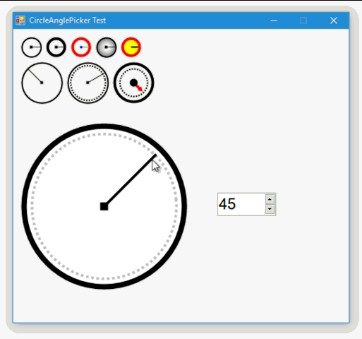

# CircleAnglePicker for Windows Forms

This is user interface element for Windows Forms, which allows to pick an angles.

The element of a circular shape, something similar can be seen in Photoshop.



To install CircleAnglePicker, run the following command in the Package Manager Console:

```
Install-Package CircleAnglePicker
```

## Requirements

* Windows Forms
* .NET Framework 2.0/3.5/4.0/4.5/4.6/4.7 or later.

## License

The MIT License (MIT)

Copyright © 2018, [@meet-aleksey](https://github.com/meet-aleksey)